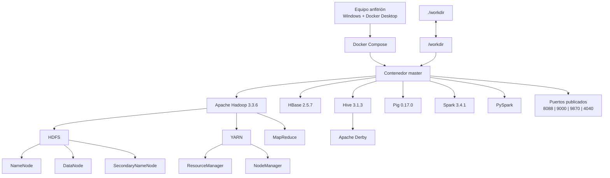

# hadoop-docker-compose - Grupo 4

**Universidad del Valle — LG14: Investigación y Despliegue de un Repositorio Big Data con Docker**

**Integrantes:** Julia Rafaela Herrera Heiden, Rafaela Kiara Marta Puente, Alejandro Vidal

---

# 1. Introducción

El presente proyecto tiene como objetivo investigar, desplegar y comprobar el funcionamiento de un repositorio público relacionado con tecnologías Big Data y contenedores Docker.

El repositorio seleccionado es **hadoop-docker-compose**, desarrollado por `dhzdhd`, el cual permite desplegar mediante Docker Compose un entorno que integra diferentes tecnologías del ecosistema Big Data, entre ellas Apache Hadoop, HDFS, YARN, MapReduce, HBase, Hive, Pig, Spark y PySpark.

La actividad se desarrolló siguiendo el proceso establecido en la práctica: **encontrar, comprender, desplegar, probar y analizar**.

Durante el desarrollo se analizó la documentación y los archivos de configuración del repositorio, especialmente `docker-compose.yaml`, `Dockerfile` y los archivos XML de configuración de Hadoop.

Posteriormente, se ejecutó el entorno mediante Docker Compose y se realizó una prueba funcional sobre HDFS, creando un directorio, almacenando un archivo y consultando posteriormente su contenido.

Finalmente, se comparó el repositorio seleccionado con **Big Data Europe - docker-hadoop**, con el propósito de identificar diferencias en arquitectura, número de contenedores, almacenamiento, procesamiento, persistencia, documentación y caso de uso.

---

# 2. Repositorio seleccionado

| Característica           | Información                                                                                           |
| ------------------------ | ----------------------------------------------------------------------------------------------------- |
| **Nombre**               | `hadoop-docker-compose`                                                                               |
| **URL**                  | https://github.com/dhzdhd/hadoop-docker-compose                                                       |
| **Autor**                | `dhzdhd`                                                                                              |
| **Tecnología principal** | Apache Hadoop / HDFS                                                                                  |
| **Descripción**          | Entorno Big Data contenerizado con Docker Compose que integra Hadoop, HDFS, Spark, Hive, HBase y Pig. |

---

# 3. Investigación del repositorio

## 3.1 Información general

El repositorio `hadoop-docker-compose` proporciona un entorno contenerizado para trabajar con diferentes tecnologías del ecosistema Big Data sin necesidad de instalar individualmente cada herramienta en el sistema anfitrión.

Los principales datos identificados son:

| Característica                  | Información               |
| ------------------------------- | ------------------------- |
| Nombre                          | `hadoop-docker-compose`   |
| Autor                           | `dhzdhd`                  |
| Fecha de creación               | 6 de febrero de 2024      |
| Última actualización registrada | 6 de abril de 2025        |
| Último push de código           | 8 de abril de 2024        |
| Estrellas                       | 6                         |
| Forks                           | 2                         |
| Licencia                        | No especificada en GitHub |
| Tecnología principal            | Apache Hadoop / HDFS      |

## 3.2 Objetivo del proyecto

El objetivo principal es proporcionar un entorno Big Data que pueda ser ejecutado mediante Docker Compose.

El proyecto concentra diferentes tecnologías dentro de un único contenedor denominado `master`, entre ellas:

- Apache Hadoop.
- HDFS.
- YARN.
- MapReduce.
- HBase.
- Hive.
- Pig.
- Spark.
- PySpark.

También contempla herramientas adicionales como ZooKeeper, Mahout y Kafka mediante la inicialización opcional `init-extra`.

El proyecto está orientado principalmente al **aprendizaje, desarrollo y experimentación con tecnologías Big Data**.

## 3.3 Tecnologías utilizadas

| Tecnología     | Versión / función          |
| -------------- | -------------------------- |
| Apache Hadoop  | 3.3.6                      |
| HDFS           | Incluido en Hadoop         |
| YARN           | Incluido en Hadoop         |
| Apache Pig     | 0.17.0                     |
| Apache HBase   | 2.5.7                      |
| Apache Hive    | 3.1.3                      |
| Apache Spark   | 3.4.1                      |
| PySpark        | Instalado mediante pip     |
| Docker         | Contenerización            |
| Docker Compose | Administración del entorno |
| Ubuntu         | Sistema operativo base     |
| OpenJDK        | 8                          |
| Apache Derby   | Metastore de Hive          |
| Python         | Utilizado por PySpark      |
| Scala          | Entorno de Spark           |

## 3.4 Tecnología Big Data principal

La tecnología principal es **Apache Hadoop 3.3.6**, principalmente mediante **HDFS** y **YARN**.

HDFS permite almacenar archivos dentro del entorno Hadoop, mientras que YARN administra los recursos utilizados por las aplicaciones y MapReduce permite realizar procesamiento de datos.

Sobre esta base se integran otras herramientas como HBase, Hive, Pig y Spark.

## 3.5 Docker y Docker Compose

Docker permite ejecutar el entorno dentro de un contenedor, mientras que Docker Compose permite definir y administrar dicho entorno.

El archivo principal es:

```text
docker-compose.yaml
```

Este archivo define el servicio:

```text
master
```

El servicio utiliza la imagen:

```text
ghcr.io/dhzdhd/hadoop-docker-compose:v1.2.5
```

La imagen se construye originalmente a partir de:

```dockerfile
FROM ubuntu:latest
```

## 3.6 Sistema operativo base

El contenedor utiliza **Ubuntu** como sistema operativo base.

El Dockerfile utiliza:

```dockerfile
FROM ubuntu:latest
```

Por lo tanto, las herramientas Big Data se ejecutan dentro de un entorno Linux basado en Ubuntu.

## 3.7 Base de datos

El proyecto utiliza **Apache Derby** para la inicialización del metastore de Hive.

La inicialización se realiza mediante:

```bash
schematool -dbType derby -initSchema
```

Derby se utiliza para almacenar la información correspondiente al esquema de metadatos de Hive.

## 3.8 Lenguajes utilizados

Durante el análisis se identificaron principalmente:

- **Java:** utilizado por Hadoop y diferentes componentes del ecosistema.
- **Python:** utilizado por PySpark.
- **Scala:** utilizado en el entorno de Spark.
- **Bash:** utilizado en scripts de inicialización.
- **PowerShell:** utilizado mediante `run.ps1` para facilitar la ejecución en Windows.

---

# 4. Análisis de arquitectura

## 4.1 Arquitectura general

El repositorio utiliza una arquitectura contenerizada de **un solo nodo**.

Docker Compose define un único servicio llamado:

```text
master
```

Dentro de este contenedor se encuentran las diferentes tecnologías Big Data.

Esto significa que no existe un contenedor independiente para cada componente de Hadoop.

La estructura principal es:

```text
Docker Compose
      |
      v
  Contenedor master
      |
      +-- Hadoop 3.3.6
      |     |
      |     +-- HDFS
      |     |    +-- NameNode
      |     |    +-- DataNode
      |     |    +-- SecondaryNameNode
      |     |
      |     +-- YARN
      |     |    +-- ResourceManager
      |     |    +-- NodeManager
      |     |
      |     +-- MapReduce
      |
      +-- HBase 2.5.7
      |
      +-- Hive 3.1.3
      |     |
      |     +-- Apache Derby
      |
      +-- Pig 0.17.0
      |
      +-- Spark 3.4.1
      |
      +-- PySpark
```

## 4.2 Contenedor

El proyecto utiliza un único contenedor:

| Contenedor | Función                                                                   |
| ---------- | ------------------------------------------------------------------------- |
| `master`   | Ejecuta Hadoop, HDFS, YARN, MapReduce, HBase, Hive, Pig, Spark y PySpark. |

Esta es una diferencia importante respecto a arquitecturas Hadoop donde cada componente puede ejecutarse en diferentes contenedores.

## 4.3 Imagen Docker

El contenedor `master` utiliza:

```text
ghcr.io/dhzdhd/hadoop-docker-compose:v1.2.5
```

La imagen tiene como base:

```dockerfile
ubuntu:latest
```

Dentro de ella se encuentran instaladas las principales tecnologías del proyecto.

## 4.4 Puertos

Los puertos publicados por Docker Compose son:

| Puerto | Función                                |
| -----: | -------------------------------------- |
| `8088` | Interfaz web de YARN / ResourceManager |
| `9000` | Acceso a HDFS                          |
| `9870` | Interfaz web de NameNode               |
| `4040` | Interfaz de aplicaciones Spark         |

La dirección principal de HDFS es:

```text
hdfs://master:9000
```

## 4.5 Volumen

El proyecto utiliza:

```yaml
./workdir:/workdir
```

Esto significa:

```text
Equipo anfitrión
./workdir
      |
      | volumen
      v
Contenedor master
/workdir
```

Este volumen permite compartir archivos entre el sistema anfitrión y el contenedor.

Por ejemplo, el archivo:

```text
/workdir/datos.txt
```

puede existir también en la carpeta `workdir` del equipo.

## 4.6 Red

No se define una red personalizada en `docker-compose.yaml`.

Docker Compose administra la red necesaria para ejecutar el servicio.

Debido a que el proyecto utiliza un único contenedor, no existe comunicación entre varios servicios Docker.

## 4.7 Dependencias

El archivo Docker Compose no utiliza `depends_on`.

Esto se debe a que únicamente existe un servicio:

```text
master
```

Las relaciones entre Hadoop, HDFS, YARN, HBase, Hive y las demás herramientas ocurren dentro del mismo contenedor.

## 4.8 Variables de entorno

Entre las principales variables utilizadas se encuentran:

```text
HADOOP_HOME=/usr/local/hadoop

HDFS_NAMENODE_USER=root
HDFS_DATANODE_USER=root
HDFS_SECONDARYNAMENODE_USER=root

YARN_NODEMANAGER_USER=root
YARN_RESOURCEMANAGER_USER=root
```

Estas variables permiten definir la ubicación de Hadoop y los usuarios utilizados por los principales procesos.

## 4.9 Archivos de configuración

Los principales archivos identificados son:

| Archivo               | Función                                              |
| --------------------- | ---------------------------------------------------- |
| `docker-compose.yaml` | Define el servicio Docker, puertos y volumen.        |
| `Dockerfile`          | Define la imagen y tecnologías instaladas.           |
| `core-site.xml`       | Configura el sistema de archivos principal.          |
| `hdfs-site.xml`       | Configura NameNode, DataNode, replicación y bloques. |
| `mapred-site.xml`     | Configura MapReduce para utilizar YARN.              |
| `yarn-site.xml`       | Configura YARN.                                      |
| `hbase-site.xml`      | Configura HBase.                                     |
| `init`                | Inicializa Hadoop, HBase y Hive.                     |
| `run.ps1`             | Facilita la ejecución en Windows.                    |
| `run.sh`              | Facilita la ejecución en Linux.                      |

---

# 5. Diagrama de arquitectura

El siguiente diagrama representa la arquitectura real identificada en el repositorio:



### Interpretación del diagrama

El usuario ejecuta Docker Compose desde el equipo anfitrión. Docker Compose inicia el contenedor `master`.

Dentro de `master` se encuentran Hadoop y sus componentes principales:

- HDFS.
- YARN.
- MapReduce.

También se encuentran instaladas herramientas adicionales:

- HBase.
- Hive.
- Pig.
- Spark.
- PySpark.

El directorio `./workdir` del equipo anfitrión se conecta con `/workdir` dentro del contenedor mediante un volumen.

---

# 6. Comparación con Big Data Europe - docker-hadoop

Para identificar las diferencias entre ambos proyectos se utilizó como referencia:

https://github.com/big-data-europe/docker-hadoop

El objetivo de la comparación no es determinar cuál proyecto es mejor, sino identificar sus diferencias de arquitectura, configuración, almacenamiento, procesamiento y propósito.

## 6.1 Tabla comparativa

| Característica         | `docker-hadoop`                               | `hadoop-docker-compose`                         |
| ---------------------- | --------------------------------------------- | ----------------------------------------------- |
| Tecnología principal   | Apache Hadoop / HDFS                          | Apache Hadoop / HDFS                            |
| Versión Hadoop         | 3.2.1                                         | 3.3.6                                           |
| Docker                 | Sí                                            | Sí                                              |
| Docker Compose         | Sí                                            | Sí                                              |
| Número de contenedores | 5 principales                                 | 1                                               |
| Arquitectura           | Componentes separados                         | Componentes integrados en `master`              |
| Almacenamiento         | HDFS con NameNode y DataNode separados        | HDFS dentro de `master`                         |
| Procesamiento          | YARN y MapReduce separados                    | YARN y MapReduce dentro de `master`             |
| Interfaces web         | Varias interfaces independientes              | 8088, 9870 y 4040                               |
| Persistencia           | Volúmenes Docker para componentes principales | `/workdir` para compartir archivos              |
| Configuración          | Principalmente mediante `hadoop.env`          | XML, Dockerfile y scripts                       |
| Complejidad            | Mayor cantidad de servicios                   | Menor cantidad de servicios                     |
| Documentación          | Hadoop, WordCount, interfaces y Docker Swarm  | Windows/Linux, HDFS, `init` e interfaces        |
| Caso de uso            | Entorno Hadoop con componentes separados      | Aprendizaje, pruebas y experimentación Big Data |

## 6.2 Diferencia principal de arquitectura

La diferencia más importante es la distribución de los componentes.

`docker-hadoop` utiliza varios contenedores:

```text
namenode
datanode
resourcemanager
nodemanager
historyserver
```

Mientras que `hadoop-docker-compose` utiliza:

```text
master
```

y dentro de este contenedor concentra:

```text
Hadoop
HDFS
YARN
MapReduce
HBase
Hive
Pig
Spark
PySpark
```

Por lo tanto, `docker-hadoop` presenta una mayor separación de responsabilidades, mientras que `hadoop-docker-compose` prioriza la simplicidad del despliegue.

## 6.3 Almacenamiento

Ambos utilizan HDFS.

En `docker-hadoop`, NameNode y DataNode se encuentran en diferentes contenedores y existen volúmenes para conservar información.

En `hadoop-docker-compose`, HDFS funciona dentro de `master`.

Aunque `hdfs-site.xml` establece un factor de replicación de `3`, el entorno utiliza actualmente un único nodo, por lo que no existen tres DataNodes independientes.

## 6.4 Procesamiento

Ambos proyectos utilizan Hadoop MapReduce y YARN.

En `docker-hadoop`, ResourceManager y NodeManager están separados.

En `hadoop-docker-compose`, ambos funcionan dentro del mismo contenedor `master`.

El repositorio de referencia también incluye una prueba WordCount mediante:

```bash
make wordcount
```

## 6.5 Persistencia

`docker-hadoop` utiliza volúmenes Docker para componentes como:

```text
hadoop_namenode
hadoop_datanode
hadoop_historyserver
```

En cambio, `hadoop-docker-compose` utiliza:

```text
./workdir:/workdir
```

para compartir archivos con el equipo anfitrión.

Por ello, los archivos importantes que se quieran conservar pueden mantenerse en `workdir`.

## 6.6 Complejidad

`docker-hadoop` presenta mayor complejidad debido a la existencia de varios servicios y relaciones entre ellos.

`hadoop-docker-compose` simplifica el despliegue porque utiliza un único contenedor.

Esta característica lo hace apropiado para aprendizaje y experimentación, aunque no representa un clúster Hadoop multinodo tradicional.

## 6.7 Conclusión de la comparación

Los dos repositorios permiten trabajar con Hadoop mediante Docker, pero utilizan enfoques diferentes.

`docker-hadoop` separa los componentes principales en distintos contenedores, mientras que `hadoop-docker-compose` concentra varias tecnologías Big Data en un único contenedor `master`.

Por lo tanto, la diferencia principal está en el propósito y la arquitectura: el primero permite observar una separación más clara de los componentes Hadoop, mientras que el segundo facilita el despliegue y la experimentación con diferentes tecnologías Big Data.

---

# 7. Prueba funcional HDFS

La prueba funcional se realizó directamente sobre HDFS.

## 7.1 Verificar HDFS

```bash
hdfs dfsadmin -report
```

## 7.2 Crear un directorio

```bash
hdfs dfs -mkdir -p /prueba_bigdata
```

## 7.3 Crear y cargar un archivo

```bash
echo "Hola Big Data - Grupo 4 - Hadoop en Docker" > /workdir/datos.txt

hdfs dfs -put /workdir/datos.txt /prueba_bigdata/
```

## 7.4 Consultar el archivo

```bash
hdfs dfs -ls /prueba_bigdata

hdfs dfs -cat /prueba_bigdata/datos.txt
```

### Resultado

La prueba permitió comprobar que:

1. HDFS estaba funcionando.
2. Se pudo crear un directorio.
3. Se pudo cargar un archivo.
4. El archivo quedó almacenado en HDFS.
5. Se pudo recuperar y visualizar su contenido.

Resultado esperado:

```text
Hola Big Data - Grupo 4 - Hadoop en Docker
```

---

# 8. Conclusión

La práctica permitió completar el proceso de **encontrar, comprender, desplegar, probar y analizar** un repositorio relacionado con Big Data.

El repositorio seleccionado utiliza Docker Compose para desplegar un entorno basado principalmente en Apache Hadoop 3.3.6 y HDFS, integrando además herramientas como YARN, MapReduce, HBase, Hive, Pig, Spark y PySpark.

El análisis de `docker-compose.yaml`, `Dockerfile` y los archivos de configuración permitió identificar que el proyecto utiliza un único contenedor denominado `master`, dentro del cual se ejecutan los principales componentes.

La prueba funcional sobre HDFS permitió crear un directorio, cargar un archivo y recuperar su contenido, comprobando el funcionamiento del sistema de archivos.

Finalmente, la comparación con `docker-hadoop` permitió identificar que ambos proyectos utilizan Hadoop y Docker, pero presentan arquitecturas diferentes. `docker-hadoop` separa los principales componentes en distintos contenedores, mientras que `hadoop-docker-compose` concentra las tecnologías en un único contenedor.

Por sus características, el repositorio seleccionado resulta apropiado para actividades de aprendizaje, experimentación y pruebas con diferentes tecnologías del ecosistema Big Data.
