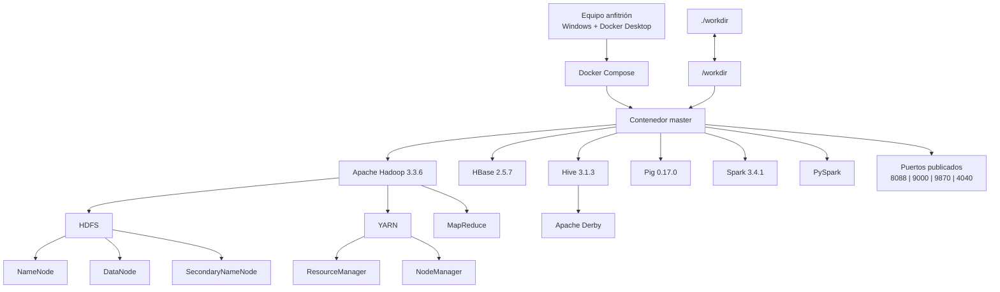

# hadoop-docker-compose - Grupo 4

**Universidad del Valle — LG14: Investigación y Despliegue de un Repositorio Big Data con Docker**

**Integrantes:** Julia Rafaela Herrera Heiden, Rafaela Kiara Marta Puente, Alejandro Vidal

---

# 1. Introducción

El presente proyecto tiene como objetivo investigar, desplegar y comprobar el funcionamiento de un repositorio público relacionado con tecnologías Big Data y contenedores Docker.

El repositorio seleccionado es **hadoop-docker-compose**, desarrollado por `dhzdhd`, el cual permite desplegar mediante Docker Compose un entorno que integra diferentes tecnologías del ecosistema Big Data, entre ellas Apache Hadoop, HDFS, YARN, MapReduce, HBase, Hive, Pig, Spark y PySpark.

La actividad se desarrolló siguiendo el proceso establecido en la práctica: **encontrar, comprender, desplegar, probar y analizar**.

Durante el desarrollo se analizó la documentación y los archivos de configuración del repositorio, especialmente `docker-compose.yaml`, `Dockerfile` y los archivos XML de configuración de Hadoop.

Posteriormente, se ejecutó el entorno mediante Docker Compose y se realizó una prueba funcional sobre HDFS, creando un directorio, almacenando un archivo y consultando posteriormente su contenido.

Finalmente, se comparó el repositorio seleccionado con **Big Data Europe - docker-hadoop**, con el propósito de identificar diferencias en arquitectura, número de contenedores, almacenamiento, procesamiento, persistencia, documentación y caso de uso.

---

# 2. Repositorio seleccionado

| Característica           | Información                                                                                           |
| ------------------------ | ----------------------------------------------------------------------------------------------------- |
| **Nombre**               | `hadoop-docker-compose`                                                                               |
| **URL**                  | https://github.com/dhzdhd/hadoop-docker-compose                                                       |
| **Autor**                | `dhzdhd`                                                                                              |
| **Tecnología principal** | Apache Hadoop / HDFS                                                                                  |
| **Descripción**          | Entorno Big Data contenerizado con Docker Compose que integra Hadoop, HDFS, Spark, Hive, HBase y Pig. |

---

# 3. Investigación del repositorio

## 3.1 Información general

El repositorio `hadoop-docker-compose` proporciona un entorno contenerizado para trabajar con diferentes tecnologías del ecosistema Big Data sin necesidad de instalar individualmente cada herramienta en el sistema anfitrión.

Los principales datos identificados son:

| Característica                  | Información               |
| ------------------------------- | ------------------------- |
| Nombre                          | `hadoop-docker-compose`   |
| Autor                           | `dhzdhd`                  |
| Fecha de creación               | 6 de febrero de 2024      |
| Última actualización registrada | 6 de abril de 2025        |
| Último push de código           | 8 de abril de 2024        |
| Estrellas                       | 6                         |
| Forks                           | 2                         |
| Licencia                        | No especificada en GitHub |
| Tecnología principal            | Apache Hadoop / HDFS      |

## 3.2 Objetivo del proyecto

El objetivo principal es proporcionar un entorno Big Data que pueda ser ejecutado mediante Docker Compose.

El proyecto concentra diferentes tecnologías dentro de un único contenedor denominado `master`, entre ellas:

- Apache Hadoop.
- HDFS.
- YARN.
- MapReduce.
- HBase.
- Hive.
- Pig.
- Spark.
- PySpark.

También contempla herramientas adicionales como ZooKeeper, Mahout y Kafka mediante la inicialización opcional `init-extra`.

El proyecto está orientado principalmente al **aprendizaje, desarrollo y experimentación con tecnologías Big Data**.

## 3.3 Tecnologías utilizadas

| Tecnología     | Versión / función          |
| -------------- | -------------------------- |
| Apache Hadoop  | 3.3.6                      |
| HDFS           | Incluido en Hadoop         |
| YARN           | Incluido en Hadoop         |
| Apache Pig     | 0.17.0                     |
| Apache HBase   | 2.5.7                      |
| Apache Hive    | 3.1.3                      |
| Apache Spark   | 3.4.1                      |
| PySpark        | Instalado mediante pip     |
| Docker         | Contenerización            |
| Docker Compose | Administración del entorno |
| Ubuntu         | Sistema operativo base     |
| OpenJDK        | 8                          |
| Apache Derby   | Metastore de Hive          |
| Python         | Utilizado por PySpark      |
| Scala          | Entorno de Spark           |

## 3.4 Tecnología Big Data principal

La tecnología principal es **Apache Hadoop 3.3.6**, principalmente mediante **HDFS** y **YARN**.

HDFS permite almacenar archivos dentro del entorno Hadoop, mientras que YARN administra los recursos utilizados por las aplicaciones y MapReduce permite realizar procesamiento de datos.

Sobre esta base se integran otras herramientas como HBase, Hive, Pig y Spark.

## 3.5 Docker y Docker Compose

Docker permite ejecutar el entorno dentro de un contenedor, mientras que Docker Compose permite definir y administrar dicho entorno.

El archivo principal es:

```text
docker-compose.yaml
```

Este archivo define el servicio:

```text
master
```

El servicio utiliza la imagen:

```text
ghcr.io/dhzdhd/hadoop-docker-compose:v1.2.5
```

La imagen se construye originalmente a partir de:

```dockerfile
FROM ubuntu:latest
```

## 3.6 Sistema operativo base

El contenedor utiliza **Ubuntu** como sistema operativo base.

El Dockerfile utiliza:

```dockerfile
FROM ubuntu:latest
```

Por lo tanto, las herramientas Big Data se ejecutan dentro de un entorno Linux basado en Ubuntu.

## 3.7 Base de datos

El proyecto utiliza **Apache Derby** para la inicialización del metastore de Hive.

La inicialización se realiza mediante:

```bash
schematool -dbType derby -initSchema
```

Derby se utiliza para almacenar la información correspondiente al esquema de metadatos de Hive.

## 3.8 Lenguajes utilizados

Durante el análisis se identificaron principalmente:

- **Java:** utilizado por Hadoop y diferentes componentes del ecosistema.
- **Python:** utilizado por PySpark.
- **Scala:** utilizado en el entorno de Spark.
- **Bash:** utilizado en scripts de inicialización.
- **PowerShell:** utilizado mediante `run.ps1` para facilitar la ejecución en Windows.

---

# 4. Análisis de arquitectura

## 4.1 Arquitectura general

El repositorio utiliza una arquitectura contenerizada de **un solo nodo**.

Docker Compose define un único servicio llamado:

```text
master
```

Dentro de este contenedor se encuentran las diferentes tecnologías Big Data.

Esto significa que no existe un contenedor independiente para cada componente de Hadoop.

La estructura principal es:

```text
Docker Compose
      |
      v
  Contenedor master
      |
      +-- Hadoop 3.3.6
      |     |
      |     +-- HDFS
      |     |    +-- NameNode
      |     |    +-- DataNode
      |     |    +-- SecondaryNameNode
      |     |
      |     +-- YARN
      |     |    +-- ResourceManager
      |     |    +-- NodeManager
      |     |
      |     +-- MapReduce
      |
      +-- HBase 2.5.7
      |
      +-- Hive 3.1.3
      |     |
      |     +-- Apache Derby
      |
      +-- Pig 0.17.0
      |
      +-- Spark 3.4.1
      |
      +-- PySpark
```

## 4.2 Contenedor

El proyecto utiliza un único contenedor:

| Contenedor | Función                                                                   |
| ---------- | ------------------------------------------------------------------------- |
| `master`   | Ejecuta Hadoop, HDFS, YARN, MapReduce, HBase, Hive, Pig, Spark y PySpark. |

Esta es una diferencia importante respecto a arquitecturas Hadoop donde cada componente puede ejecutarse en diferentes contenedores.

## 4.3 Imagen Docker

El contenedor `master` utiliza:

```text
ghcr.io/dhzdhd/hadoop-docker-compose:v1.2.5
```

La imagen tiene como base:

```dockerfile
ubuntu:latest
```

Dentro de ella se encuentran instaladas las principales tecnologías del proyecto.

## 4.4 Puertos

Los puertos publicados por Docker Compose son:

| Puerto | Función                                |
| -----: | -------------------------------------- |
| `8088` | Interfaz web de YARN / ResourceManager |
| `9000` | Acceso a HDFS                          |
| `9870` | Interfaz web de NameNode               |
| `4040` | Interfaz de aplicaciones Spark         |

La dirección principal de HDFS es:

```text
hdfs://master:9000
```

## 4.5 Volumen

El proyecto utiliza:

```yaml
./workdir:/workdir
```

Esto significa:

```text
Equipo anfitrión
./workdir
      |
      | volumen
      v
Contenedor master
/workdir
```

Este volumen permite compartir archivos entre el sistema anfitrión y el contenedor.

Por ejemplo, el archivo:

```text
/workdir/datos.txt
```

puede existir también en la carpeta `workdir` del equipo.

## 4.6 Red

No se define una red personalizada en `docker-compose.yaml`.

Docker Compose administra la red necesaria para ejecutar el servicio.

Debido a que el proyecto utiliza un único contenedor, no existe comunicación entre varios servicios Docker.

## 4.7 Dependencias

El archivo Docker Compose no utiliza `depends_on`.

Esto se debe a que únicamente existe un servicio:

```text
master
```

Las relaciones entre Hadoop, HDFS, YARN, HBase, Hive y las demás herramientas ocurren dentro del mismo contenedor.

## 4.8 Variables de entorno

Entre las principales variables utilizadas se encuentran:

```text
HADOOP_HOME=/usr/local/hadoop

HDFS_NAMENODE_USER=root
HDFS_DATANODE_USER=root
HDFS_SECONDARYNAMENODE_USER=root

YARN_NODEMANAGER_USER=root
YARN_RESOURCEMANAGER_USER=root
```

Estas variables permiten definir la ubicación de Hadoop y los usuarios utilizados por los principales procesos.

## 4.9 Archivos de configuración

Los principales archivos identificados son:

| Archivo               | Función                                              |
| --------------------- | ---------------------------------------------------- |
| `docker-compose.yaml` | Define el servicio Docker, puertos y volumen.        |
| `Dockerfile`          | Define la imagen y tecnologías instaladas.           |
| `core-site.xml`       | Configura el sistema de archivos principal.          |
| `hdfs-site.xml`       | Configura NameNode, DataNode, replicación y bloques. |
| `mapred-site.xml`     | Configura MapReduce para utilizar YARN.              |
| `yarn-site.xml`       | Configura YARN.                                      |
| `hbase-site.xml`      | Configura HBase.                                     |
| `init`                | Inicializa Hadoop, HBase y Hive.                     |
| `run.ps1`             | Facilita la ejecución en Windows.                    |
| `run.sh`              | Facilita la ejecución en Linux.                      |

---

# 5. Diagrama de arquitectura

El siguiente diagrama representa la arquitectura real identificada en el repositorio:



### Interpretación del diagrama

El usuario ejecuta Docker Compose desde el equipo anfitrión. Docker Compose inicia el contenedor `master`.

Dentro de `master` se encuentran Hadoop y sus componentes principales:

- HDFS.
- YARN.
- MapReduce.

También se encuentran instaladas herramientas adicionales:

- HBase.
- Hive.
- Pig.
- Spark.
- PySpark.

El directorio `./workdir` del equipo anfitrión se conecta con `/workdir` dentro del contenedor mediante un volumen.

---

# 6. Comparación con Big Data Europe - docker-hadoop

Para identificar las diferencias de arquitectura, tecnologias y proposito, se comparo el repositorio seleccionado `dhzdhd/hadoop-docker-compose` con el repositorio de referencia **Big Data Europe - docker-hadoop**.

**Repositorio de referencia:**  
https://github.com/big-data-europe/docker-hadoop

> El objetivo de la comparacion no es determinar cual proyecto es mejor, sino analizar las diferencias en su arquitectura, configuracion, persistencia, procesamiento y caso de uso.

### 6.1 Tabla comparativa

| Caracteristica | `docker-hadoop` | `hadoop-docker-compose` |
|---|---|---|
| **Tecnologia principal** | Apache Hadoop / HDFS | Apache Hadoop / HDFS |
| **Version de Hadoop** | 3.2.1 | 3.3.6 |
| **Docker** | Si | Si |
| **Docker Compose** | Si | Si |
| **Servicios principales** | 5 servicios principales | 1 servicio |
| **Arquitectura** | Componentes Hadoop separados en diferentes contenedores | Tecnologias Big Data integradas dentro del contenedor `master` |
| **Almacenamiento distribuido** | HDFS con NameNode y DataNode separados | HDFS ejecutado dentro del unico nodo `master` |
| **Procesamiento distribuido** | MapReduce y YARN con ResourceManager y NodeManager separados | MapReduce y YARN ejecutados dentro del mismo contenedor |
| **Interfaces web** | NameNode, DataNode, ResourceManager, NodeManager e HistoryServer | ResourceManager y NameNode; tambien se publica el puerto de Spark |
| **Persistencia** | Volumenes Docker para NameNode, DataNode e HistoryServer | HDFS y HBase sin volumenes persistentes; `/workdir` permite conservar archivos en el host |
| **Configuracion** | Principalmente mediante `hadoop.env` y variables de entorno | Archivos XML, Dockerfile y scripts de inicializacion |
| **Complejidad de despliegue** | Mayor cantidad de servicios y relaciones entre componentes | Despliegue simplificado mediante un unico contenedor |
| **Documentacion** | Despliegue, configuracion, interfaces web, WordCount y Docker Swarm | Instalacion en Windows/Linux, inicializacion, acceso a HDFS e interfaces web |
| **Caso de uso** | Entorno Hadoop contenerizado con componentes separados | Entorno integrado para aprendizaje y pruebas con varias tecnologias Big Data |

### 6.2 Diferencias de arquitectura

La principal diferencia se encuentra en la forma en que ambos proyectos organizan los componentes de Hadoop.

`docker-hadoop` define varios servicios especializados:

```text
docker-hadoop
├── namenode
├── datanode
├── resourcemanager
├── nodemanager
└── historyserver
```

Cada componente se ejecuta en un contenedor independiente y cumple una responsabilidad especifica.

- **NameNode:** administra los metadatos de HDFS.
- **DataNode:** almacena los bloques de datos.
- **ResourceManager:** administra los recursos de YARN.
- **NodeManager:** administra las tareas y recursos correspondientes al nodo.
- **HistoryServer:** conserva informacion relacionada con la ejecucion de aplicaciones.

En cambio, `hadoop-docker-compose` concentra las tecnologias dentro de un unico contenedor:

```text
hadoop-docker-compose
└── master
    ├── Hadoop
    ├── HDFS
    ├── YARN
    ├── MapReduce
    ├── HBase
    ├── Hive
    ├── Pig
    ├── Spark
    └── PySpark
```

Por lo tanto, `docker-hadoop` presenta una arquitectura con mayor separacion de responsabilidades a nivel de contenedores, mientras que `hadoop-docker-compose` utiliza una arquitectura mas compacta.

### 6.3 Numero de servicios y contenedores

El archivo `docker-compose.yml` analizado de `docker-hadoop` define cinco servicios principales:

- `namenode`
- `datanode`
- `resourcemanager`
- `nodemanager1`
- `historyserver`

El servicio `nodemanager1` genera un contenedor denominado `nodemanager`.

Por otro lado, `hadoop-docker-compose` define solamente un servicio:

`master`

Esta diferencia permite observar dos estrategias distintas de despliegue: separacion de componentes frente a integracion dentro de un unico contenedor.

### 6.4 Almacenamiento distribuido

Ambos proyectos utilizan **HDFS** como sistema de archivos.

En `docker-hadoop`, los principales componentes de HDFS se encuentran separados:

```text
NameNode
   |
   v
DataNode
```

Ademas, el proyecto define volumenes Docker para conservar informacion:

```text
hadoop_namenode
hadoop_datanode
hadoop_historyserver
```

En `hadoop-docker-compose`, HDFS se ejecuta dentro del contenedor `master` y utiliza:

`hdfs://master:9000`

como direccion principal.

El archivo `hdfs-site.xml` establece un factor de replicacion de `3`. Sin embargo, el despliegue actual solamente cuenta con un DataNode, por lo que no existen tres DataNodes independientes donde distribuir fisicamente esas replicas.

### 6.5 Procesamiento distribuido

`docker-hadoop` separa los principales componentes de YARN en distintos contenedores:

- ResourceManager
- NodeManager

Su README tambien incluye una prueba de procesamiento mediante:

```bash
make wordcount
```

Este comando permite ejecutar un ejemplo clasico de procesamiento de datos utilizando Hadoop.

En `hadoop-docker-compose`, MapReduce tambien esta configurado para utilizar YARN, pero tanto ResourceManager como NodeManager se ejecutan dentro del mismo contenedor `master`.

Por lo tanto, ambos proyectos permiten utilizar los mecanismos de procesamiento de Hadoop, aunque organizan sus componentes de manera diferente.

### 6.6 Interfaces web

`docker-hadoop` documenta interfaces web independientes para varios de sus componentes:

| Componente | Puerto |
|---|---:|
| NameNode | `9870` |
| HistoryServer | `8188` |
| DataNode | `9864` |
| NodeManager | `8042` |
| ResourceManager | `8088` |

En `hadoop-docker-compose`, las principales interfaces publicadas son:

| Componente | Acceso |
|---|---|
| YARN ResourceManager | `http://localhost:8088` |
| HDFS NameNode | `http://localhost:9870` |
| HDFS | `hdfs://master:9000` |
| Spark | Puerto `4040` cuando existe una aplicacion Spark activa |

Esto muestra que `docker-hadoop` expone interfaces independientes para una mayor cantidad de componentes.

### 6.7 Persistencia

Una de las diferencias mas importantes se encuentra en la persistencia de datos.

`docker-hadoop` define volumenes Docker:

```text
hadoop_namenode:/hadoop/dfs/name
hadoop_datanode:/hadoop/dfs/data
hadoop_historyserver:/hadoop/yarn/timeline
```

Estos volumenes permiten conservar informacion utilizada por NameNode, DataNode e HistoryServer aunque los contenedores sean recreados.

En cambio, `hadoop-docker-compose` no define volumenes persistentes para HDFS o HBase.

El proyecto utiliza:

```text
./workdir:/workdir
```

para compartir archivos entre el contenedor y el sistema anfitrion.

Por esta razon, `/workdir` debe utilizarse para conservar archivos importantes fuera del ciclo de vida del contenedor.

### 6.8 Configuracion

`docker-hadoop` centraliza gran parte de su configuracion mediante:

`hadoop.env`

Las variables definidas en este archivo pueden transformarse en propiedades correspondientes a archivos de configuracion como:

- `core-site.xml`
- `hdfs-site.xml`
- `yarn-site.xml`
- `mapred-site.xml`
- `httpfs-site.xml`
- `kms-site.xml`

En cambio, `hadoop-docker-compose` incluye directamente archivos XML dentro de:

[`config/hadoop/`](config/hadoop/)

entre ellos:

- [`core-site.xml`](config/hadoop/core-site.xml)
- [`hdfs-site.xml`](config/hadoop/hdfs-site.xml)
- [`mapred-site.xml`](config/hadoop/mapred-site.xml)
- [`yarn-site.xml`](config/hadoop/yarn-site.xml)
- [`hbase-site.xml`](config/hadoop/hbase-site.xml)

Tambien utiliza scripts como:

- [`init`](scripts/init)
- [`run.ps1`](scripts/run.ps1)
- [`run.sh`](scripts/run.sh)

para inicializar y administrar el entorno.

### 6.9 Complejidad de despliegue

`docker-hadoop` presenta una arquitectura mas amplia debido a que utiliza varios servicios especializados y relaciones entre ellos.

Por ejemplo, componentes como DataNode, ResourceManager y NodeManager requieren que otros servicios se encuentren disponibles antes de iniciar correctamente.

Por otro lado, `hadoop-docker-compose` simplifica el despliegue al concentrar las tecnologias dentro de un unico contenedor `master`.

Esto facilita su utilizacion en actividades de aprendizaje y experimentacion, aunque reduce la separacion entre los distintos componentes del ecosistema Hadoop.

### 6.10 Documentacion

Ambos repositorios proporcionan documentacion suficiente para comprender su ejecucion, aunque su enfoque es diferente.

`docker-hadoop` documenta:

- despliegue mediante Docker Compose;
- ejecucion de un ejemplo WordCount;
- despliegue mediante Docker Swarm;
- acceso a interfaces web;
- configuracion mediante variables de entorno.

`hadoop-docker-compose` documenta:

- instalacion y ejecucion en Windows y Linux;
- inicializacion mediante `init`;
- acceso a HDFS;
- acceso a interfaces web;
- utilizacion de `/workdir`;
- problemas frecuentes y posibles soluciones.

### 6.11 Caso de uso

`docker-hadoop` esta orientado principalmente al despliegue de un entorno Hadoop contenerizado donde los componentes principales se encuentran separados en distintos servicios Docker.

Esta arquitectura permite observar con mayor claridad la division de responsabilidades entre los componentes de Hadoop.

`hadoop-docker-compose`, en cambio, proporciona un entorno integrado que incorpora:

- Hadoop
- HDFS
- YARN
- HBase
- Hive
- Pig
- Spark
- PySpark

dentro de un unico nodo `master`.

Por esta razon, su enfoque resulta adecuado para aprendizaje, experimentacion y pruebas con distintas tecnologias Big Data.

### 6.12 Conclusion de la comparacion

La comparacion permite identificar dos enfoques diferentes para desplegar Hadoop mediante Docker.

`docker-hadoop` utiliza una arquitectura con mayor separacion de componentes a nivel de contenedores, distribuyendo servicios como NameNode, DataNode, ResourceManager, NodeManager y HistoryServer. Ademas, utiliza volumenes Docker para proporcionar persistencia a diferentes componentes del entorno.

Por otro lado, `hadoop-docker-compose` concentra Hadoop y diferentes tecnologias complementarias dentro de un unico contenedor `master`, simplificando el despliegue e incorporando herramientas adicionales como HBase, Hive, Pig y Spark.

> La comparacion no busca determinar cual repositorio es mejor. `docker-hadoop` representa de manera mas clara la separacion de servicios de Hadoop, mientras que `hadoop-docker-compose` ofrece un entorno mas compacto orientado al aprendizaje y experimentacion con diferentes tecnologias Big Data.

# 7. Prueba funcional HDFS

La prueba funcional se realizó directamente sobre HDFS.

## 7.1 Verificar HDFS

```bash
hdfs dfsadmin -report
```

## 7.2 Crear un directorio

```bash
hdfs dfs -mkdir -p /prueba_bigdata
```

## 7.3 Crear y cargar un archivo

```bash
echo "Hola Big Data - Grupo 4 - Hadoop en Docker" > /workdir/datos.txt

hdfs dfs -put /workdir/datos.txt /prueba_bigdata/
```

## 7.4 Consultar el archivo

```bash
hdfs dfs -ls /prueba_bigdata

hdfs dfs -cat /prueba_bigdata/datos.txt
```

### Resultado

La prueba permitió comprobar que:

1. HDFS estaba funcionando.
2. Se pudo crear un directorio.
3. Se pudo cargar un archivo.
4. El archivo quedó almacenado en HDFS.
5. Se pudo recuperar y visualizar su contenido.

Resultado esperado:

```text
Hola Big Data - Grupo 4 - Hadoop en Docker
```

---

# 8. Conclusión

El desarrollo de esta practica permitio cumplir de manera integral con el proceso de **encontrar, comprender, desplegar, probar y analizar** un repositorio Big Data contenerizado.

El repositorio seleccionado, `hadoop-docker-compose`, utiliza una arquitectura simplificada basada en un unico contenedor denominado `master`. Dentro de este entorno se integran tecnologias como **Apache Hadoop, HDFS, YARN, MapReduce, HBase, Hive, Pig, Spark y PySpark**, lo que permite disponer de diferentes herramientas Big Data dentro de una misma infraestructura Docker.

El analisis de archivos como `docker-compose.yaml`, `Dockerfile` y las configuraciones XML de Hadoop permitio comprender como se organiza el entorno, como se configura HDFS, como MapReduce utiliza YARN y como se integran componentes adicionales como HBase y Hive.

Durante la implementacion practica se comprobo que el proyecto podia desplegarse correctamente mediante Docker Compose. La ejecucion de `jps` permitio verificar la presencia de procesos como **NameNode, DataNode, SecondaryNameNode, ResourceManager, NodeManager y HMaster**, confirmando que los principales componentes del entorno se encontraban activos.

La prueba funcional realizada sobre HDFS permitio crear un directorio, cargar un archivo, comprobar su almacenamiento y recuperar posteriormente su contenido. De esta manera, se verifico de forma practica el funcionamiento del sistema de archivos utilizado por Hadoop.

La comparacion con `big-data-europe/docker-hadoop` permitio identificar dos enfoques diferentes de despliegue. Mientras `docker-hadoop` separa los principales componentes de Hadoop en distintos contenedores, `hadoop-docker-compose` concentra diferentes tecnologias dentro de un unico nodo `master`, priorizando un entorno mas compacto y sencillo para aprendizaje y experimentacion.

Tambien se identificaron algunas limitaciones del repositorio seleccionado, como el uso de un unico DataNode, la falta de persistencia directa para HDFS y HBase y el formateo de HDFS realizado durante la inicializacion mediante `init`.

> En conclusion, la practica permitio no solo ejecutar un proyecto Big Data mediante Docker, sino tambien comprender su arquitectura, configuracion, funcionamiento y principales diferencias frente a otra alternativa de despliegue basada en Hadoop.
