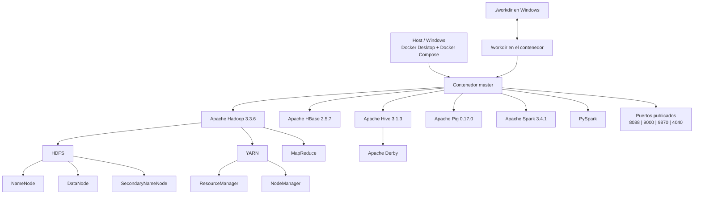

# hadoop-docker-compose-Grupo4

**Integrantes:** Julia Rafaela Herrera Heiden, Rafaela Kiara Marta Puente, Alejandro Vidal

---

## 1. Repositorio seleccionado

- **Nombre:** hadoop-docker-compose
- **URL:** https://github.com/dhzdhd/hadoop-docker-compose
- **Autor:** dhzdhd
- **Descripción:** Entorno Big Data contenerizado con Docker Compose que integra Hadoop, HDFS, Spark, Hive, HBase y Pig, con scripts de despliegue para Windows y Linux.

## 2. Informacion general

A continuacion se presentan los principales datos del repositorio seleccionado, obtenidos a partir de su informacion publica en GitHub y del historial del proyecto.

| Caracteristica | Informacion |
|---|---|
| **Nombre** | `hadoop-docker-compose` |
| **Autor / organizacion** | `dhzdhd` |
| **Repositorio** | [github.com/dhzdhd/hadoop-docker-compose](https://github.com/dhzdhd/hadoop-docker-compose) |
| **Fecha de creacion** | 6 de febrero de 2024 |
| **Ultima actualizacion registrada en GitHub** | 6 de abril de 2025 |
| **Ultimo push de codigo** | 8 de abril de 2024 |
| **Estrellas** | 6 |
| **Forks** | 2 |
| **Licencia** | No especificada en GitHub |
| **Tecnologia principal** | Apache Hadoop / HDFS |

### 2.1 Objetivo del proyecto

`hadoop-docker-compose` proporciona un entorno contenerizado basado en **Docker Compose** para desplegar, ejecutar y realizar pruebas con diferentes tecnologias del ecosistema Big Data.

El proyecto integra **Apache Hadoop, HDFS, YARN, Pig, HBase, Hive y Spark** dentro de un unico nodo denominado `master`.

Adicionalmente, contempla la inicializacion opcional de otras herramientas como **ZooKeeper, Mahout y Kafka** mediante el mecanismo `init-extra`.

> El proyecto esta orientado principalmente al aprendizaje, desarrollo y experimentacion con tecnologias Big Data, proporcionando un entorno integrado que evita instalar individualmente cada herramienta en el sistema anfitrion.

## 3. Tecnologias utilizadas

El repositorio integra diferentes tecnologias del ecosistema Big Data dentro de un unico entorno contenerizado.

| Tecnologia | Version / uso |
|---|---|
| Apache Hadoop | 3.3.6 |
| HDFS | Incluido con Hadoop 3.3.6 |
| YARN | Incluido con Hadoop 3.3.6 |
| Apache Pig | 0.17.0 |
| Apache HBase | 2.5.7 |
| Apache Hive | 3.1.3 |
| Apache Spark | 3.4.1 |
| PySpark | Instalado mediante `pip` |
| Docker | Utilizado para ejecutar el entorno contenerizado |
| Docker Compose | Utilizado mediante `docker-compose.yaml` |
| Sistema operativo base | Ubuntu (`ubuntu:latest`) |
| Java | OpenJDK 8 |
| Apache Derby | Utilizado por Hive para inicializar su esquema de metadatos |
| Python | Python 3 |
| Scala | Instalado para el entorno de Spark |

### Tecnologia Big Data principal

La tecnologia principal del proyecto es **Apache Hadoop 3.3.6**, junto con su sistema de archivos distribuido **HDFS** y el gestor de recursos **YARN**.

Sobre esta base se integran otras herramientas del ecosistema Big Data, como Hive, HBase, Pig y Spark.

### Docker y Docker Compose

El proyecto utiliza Docker para contenerizar todo el entorno y Docker Compose para gestionar su ejecucion.

El archivo `docker-compose.yaml` define un unico servicio denominado `master`, basado en la imagen:

`ghcr.io/dhzdhd/hadoop-docker-compose:v1.2.5`

El archivo Compose utiliza el formato version `3`.

### Sistema operativo base

La imagen se construye a partir de:

`ubuntu:latest`

Por lo tanto, el sistema operativo base utilizado dentro del contenedor es Ubuntu. El Dockerfile no fija una version especifica de Ubuntu.

### Base de datos

El script de inicializacion utiliza **Apache Derby** para crear el esquema de metadatos de Hive mediante:

`schematool -dbType derby -initSchema`

### Lenguajes y herramientas adicionales

El entorno utiliza principalmente Java, Python, Scala, Bash y PowerShell.

Bash se utiliza para los scripts internos del contenedor, mientras que PowerShell se utiliza mediante `run.ps1` para facilitar la ejecucion del proyecto en Windows.

El README original tambien menciona ZooKeeper, Mahout y Kafka como herramientas adicionales que pueden inicializarse mediante `init-extra`.

### 3.4 Base de datos

Durante la inicializacion de Hive se utiliza **Apache Derby** para crear el esquema correspondiente al metastore.

Esto se realiza mediante:

`schematool -dbType derby -initSchema`

Por lo tanto, Derby funciona como base de datos utilizada para la inicializacion del esquema de metadatos de Hive.

### 3.5 Lenguajes utilizados

En el entorno se identificaron principalmente los siguientes lenguajes:

- **Java:** requerido por Hadoop y otras herramientas del ecosistema.
- **Python:** utilizado en PySpark y otras herramientas del entorno.
- **Scala:** instalado como parte del entorno utilizado por Spark.
- **Bash:** utilizado en los scripts internos de inicializacion y configuracion.
- **PowerShell:** utilizado mediante `run.ps1` para facilitar la ejecucion del proyecto en Windows.

### 3.6 Herramientas adicionales

El README original tambien contempla las siguientes herramientas:

- **ZooKeeper**
- **Mahout**
- **Kafka**

Estas herramientas no forman parte de la inicializacion estandar mediante `init`, sino que pueden ser incorporadas mediante la inicializacion opcional:

`init-extra`

> Esto permite diferenciar las tecnologias instaladas y utilizadas en el entorno principal de aquellas disponibles como componentes adicionales.

## 4. Analisis de arquitectura

El repositorio `hadoop-docker-compose` utiliza una arquitectura contenerizada de un solo nodo. Docker Compose define un unico servicio denominado `master`, dentro del cual se encuentran instaladas y configuradas las diferentes tecnologias Big Data utilizadas por el proyecto.

A diferencia de una arquitectura donde cada tecnologia se ejecuta en un contenedor independiente, este proyecto concentra Hadoop, HDFS, YARN, HBase, Hive, Pig, Spark y PySpark dentro del mismo contenedor.

### 4.1 Contenedores

El archivo `docker-compose.yaml` define un unico servicio:

| Contenedor | Funcion |
|---|---|
| `master` | Contiene el entorno Hadoop y las herramientas Big Data del proyecto, incluyendo HDFS, YARN, MapReduce, HBase, Hive, Pig, Spark y PySpark. |

Actualmente el repositorio utiliza un unico nodo `master`, tal como se especifica en la documentacion original del proyecto.

### 4.2 Imagen Docker utilizada

El servicio `master` utiliza la siguiente imagen:

```text
ghcr.io/dhzdhd/hadoop-docker-compose:v1.2.5
```

La imagen se encuentra almacenada en GitHub Container Registry.

El `Dockerfile` del proyecto utiliza como base:

```dockerfile
FROM ubuntu:latest as base
```

Por lo tanto, el sistema operativo base utilizado dentro del contenedor es Ubuntu.

Dentro de esta imagen se instalan las principales tecnologias del entorno:

- Apache Hadoop 3.3.6
- Apache Pig 0.17.0
- Apache HBase 2.5.7
- Apache Hive 3.1.3
- Apache Spark 3.4.1
- PySpark
- OpenJDK 8
- Python 3
- Scala

### 4.3 Puertos

El archivo `docker-compose.yaml` publica los siguientes puertos:

| Puerto | Uso |
|---|---|
| `8088` | Interfaz web del entorno Hadoop |
| `9000` | Acceso a HDFS mediante `hdfs://master:9000` |
| `9870` | Interfaz web del entorno Hadoop |
| `4040` | Puerto publicado para el entorno Spark |

La documentacion original indica que las interfaces web pueden ser accedidas desde:

```text
http://localhost:8088
```

y:

```text
http://localhost:9870
```

HDFS se encuentra configurado mediante:

```text
hdfs://master:9000
```

El archivo `core-site.xml` confirma esta direccion:

```xml
<property>
    <name>fs.default.name</name>
    <value>hdfs://master:9000</value>
</property>
```

### 4.4 Volumen

Docker Compose define el siguiente volumen:

```yaml
volumes:
  - ./workdir:/workdir
```

Este volumen relaciona una carpeta del equipo anfitrion con una carpeta dentro del contenedor:

```text
Host                         Contenedor
./workdir        <------->   /workdir
```

Esto permite compartir archivos entre Windows y el contenedor `master`.

Los archivos que se guardan en `/workdir` dentro del contenedor pueden ser accedidos desde la carpeta `workdir` del repositorio en el equipo anfitrion.

La documentacion del proyecto advierte que los datos almacenados directamente en HDFS o HBase no cuentan con persistencia garantizada en la configuracion actual. Por este motivo, se recomienda utilizar `/workdir` para conservar archivos importantes.

### 4.5 Red

El archivo `docker-compose.yaml` no define una red personalizada.

Docker Compose administra la red necesaria para la ejecucion del servicio. Como solamente existe un contenedor, no se presenta una comunicacion entre multiples contenedores.

El nombre `master` se utiliza tambien como nombre del nodo dentro de la configuracion de Hadoop, por ejemplo:

```text
hdfs://master:9000
```

### 4.6 Dependencias entre servicios

El proyecto no utiliza `depends_on` dentro del archivo `docker-compose.yaml`.

Esto se debe a que solamente se define un servicio:

```text
master
```

Las diferentes tecnologias Big Data no se encuentran separadas en multiples servicios Docker, sino instaladas dentro del mismo contenedor.

Por lo tanto, las dependencias existentes son internas entre las diferentes tecnologias y componentes del entorno.

### 4.7 Variables de entorno

El `Dockerfile` define diferentes variables de entorno para configurar Hadoop, HDFS y YARN.

Entre las principales se encuentran:

```text
HADOOP_HOME=/usr/local/hadoop
HDFS_NAMENODE_USER=root
HDFS_DATANODE_USER=root
HDFS_SECONDARYNAMENODE_USER=root
YARN_NODEMANAGER_USER=root
YARN_RESOURCEMANAGER_USER=root
```

Tambien se modifica la variable `PATH` para permitir la ejecucion de los comandos de Hadoop y de las demas herramientas instaladas.

Estas variables permiten definir la ubicacion de Hadoop y los usuarios utilizados para ejecutar los principales procesos de HDFS y YARN.

### 4.8 Configuracion de HDFS

La configuracion principal de HDFS se encuentra en los archivos:

```text
config/hadoop/core-site.xml
config/hadoop/hdfs-site.xml
```

El archivo `core-site.xml` establece como sistema de archivos principal:

```text
hdfs://master:9000
```

El archivo `hdfs-site.xml` define los directorios utilizados por el NameNode y el DataNode:

```text
NameNode:
file:///home/hadoop/hdfs/namenode

DataNode:
file:///home/hadoop/hdfs/datanode
```

Tambien establece:

```text
Factor de replicacion: 3
Tamano de bloque: 33554432 bytes
```

El tamano configurado equivale a aproximadamente 32 MiB por bloque.

Aunque el factor de replicacion se encuentra configurado en `3`, el repositorio actualmente utiliza un unico nodo `master`.

### 4.9 MapReduce y YARN

El archivo:

```text
config/hadoop/mapred-site.xml
```

establece que MapReduce utiliza YARN como framework de ejecucion:

```xml
<property>
    <name>mapreduce.framework.name</name>
    <value>yarn</value>
</property>
```

Por lo tanto, la relacion principal es:

```text
MapReduce
    |
    v
   YARN
```

El archivo:

```text
config/hadoop/yarn-site.xml
```

habilita el servicio auxiliar:

```text
mapreduce_shuffle
```

Este servicio participa en el intercambio de los resultados intermedios generados entre las fases Map y Reduce.

Dentro del entorno Hadoop, YARN utiliza componentes como:

- ResourceManager
- NodeManager

### 4.10 Configuracion de HBase

La configuracion de HBase se encuentra en:

```text
config/hadoop/hbase-site.xml
```

El archivo establece:

```text
hbase.cluster.distributed=true
```

por lo que HBase se encuentra configurado para trabajar en modo distribuido.

Tambien define el directorio temporal:

```text
./tmp
```

Aunque HBase utiliza configuracion distribuida, el entorno actual del repositorio utiliza solamente un nodo `master`.

### 4.11 Hive y Apache Derby

Apache Hive se encuentra instalado dentro del contenedor y utiliza directorios almacenados en HDFS.

Durante la inicializacion se crean:

```text
/tmp
```

y:

```text
/user/hive/warehouse
```

El proyecto utiliza Apache Derby para inicializar el esquema del metastore de Hive mediante:

```bash
schematool -dbType derby -initSchema
```

Por lo tanto, Derby funciona como base de datos utilizada por Hive para su esquema de metadatos.

### 4.12 Archivos principales de configuracion

Los principales archivos utilizados por la arquitectura son:

| Archivo | Funcion |
|---|---|
| `docker-compose.yaml` | Define el servicio `master`, imagen, puertos y volumen. |
| `Dockerfile` | Define el sistema base, dependencias y tecnologias instaladas. |
| `config/hadoop/core-site.xml` | Configura el sistema de archivos principal de Hadoop. |
| `config/hadoop/hdfs-site.xml` | Configura NameNode, DataNode, replicacion y tamano de bloques. |
| `config/hadoop/mapred-site.xml` | Configura MapReduce para utilizar YARN. |
| `config/hadoop/yarn-site.xml` | Configura servicios auxiliares de YARN. |
| `config/hadoop/hbase-site.xml` | Configura Apache HBase. |
| `config/init` | Inicializa Hadoop, HBase y Hive. |
| `run.ps1` | Automatiza la ejecucion del entorno en Windows. |
| `run.sh` | Permite ejecutar el entorno en Linux. |

### 4.13 Inicializacion del entorno

En Windows, el proyecto utiliza el script:

```text
run.ps1
```

Su funcionamiento es el siguiente:

```text
run.ps1
   |
   v
docker compose up -d
   |
   v
Inicia el contenedor master
   |
   v
docker exec -it master /bin/bash
   |
   v
Terminal Bash dentro del contenedor
```

El comando:

```powershell
docker compose up -d
```

crea e inicia el servicio definido en `docker-compose.yaml`.

Luego:

```powershell
docker exec -it master /bin/bash
```

abre una terminal Bash interactiva dentro del contenedor `master`.

Una vez dentro del contenedor se debe ejecutar:

```bash
init
```

El script `config/init` realiza las siguientes acciones:

1. Reinicia el servicio SSH.
2. Detiene procesos anteriores de Hadoop y HBase.
3. Formatea el NameNode de HDFS.
4. Inicia los procesos principales de Hadoop.
5. Inicia HBase.
6. Crea los directorios requeridos por Hive dentro de HDFS.
7. Inicializa el esquema de Hive utilizando Derby.
8. Verifica los procesos Java mediante `jps`.

Cuando el usuario ejecuta:

```bash
exit
```

se sale del contenedor y `run.ps1` continua ejecutando:

```powershell
docker compose down
```

Este comando detiene y elimina el entorno creado por Docker Compose.

### 4.14 Arquitectura interna

La arquitectura general identificada es la siguiente:

```text
Host / Windows
│
├── Docker Desktop
├── Docker Compose
│
├── ./workdir
│       ↕
│    /workdir
│
└── Contenedor master
    │
    ├── Apache Hadoop 3.3.6
    │   │
    │   ├── HDFS
    │   │   ├── NameNode
    │   │   ├── DataNode
    │   │   └── SecondaryNameNode
    │   │
    │   ├── YARN
    │   │   ├── ResourceManager
    │   │   └── NodeManager
    │   │
    │   └── MapReduce
    │
    ├── Apache HBase 2.5.7
    │
    ├── Apache Hive 3.1.3
    │   └── Apache Derby
    │
    ├── Apache Pig 0.17.0
    │
    ├── Apache Spark 3.4.1
    │
    └── PySpark

Puertos publicados:
├── 8088
├── 9000
├── 9870
└── 4040
```

### 4.15 Diagrama de arquitectura



La caracteristica principal de esta arquitectura es que las diferentes tecnologias Big Data se encuentran concentradas dentro de un solo contenedor `master`, lo que simplifica el despliegue para entornos de aprendizaje y pruebas, aunque no representa una arquitectura Hadoop multinodo tradicional.

## 5. Instalación y ejecución (Windows, PowerShell)

**Requisitos:** Docker Desktop en ejecución y Git.

1. **Clonar**
   ```powershell
   git clone https://github.com/dhzdhd/hadoop-docker-compose.git
   ```
2. **Entrar**
   ```powershell
   cd hadoop-docker-compose
   ```
3. **Ver archivos**
   ```powershell
   dir
   ```
4. **Analizar el compose**
   ```powershell
   type docker-compose.yaml
   ```
5. **Levantar y entrar al contenedor**
   ```powershell
   docker compose up -d
   docker exec -it master /bin/bash
   ```
   Dentro del contenedor:
   ```bash
   init
   ```
6. **Desde OTRA terminal**
   ```powershell
   docker ps
   ```

Evidencias en [`evidencias/`](evidencias/).

## 6. Prueba funcional HDFS

**Script:** [`scripts/prueba_hdfs.sh`](scripts/prueba_hdfs.sh). Se ejecuta dentro del contenedor.

- `hdfs dfsadmin -report`: Estado de HDFS
- `hdfs dfs -mkdir -p /prueba_bigdata`: Crear directorio
- `hdfs dfs -put /workdir/datos.txt /prueba_bigdata/`: Listar
- `hdfs dfs -cat /prueba_bigdata/datos.txt`: Leer contenido

**Resultado:** el archivo `datos.txt` se almacenó en HDFS y su contenido se leyó correctamente (`Hola Big Data - Grupo 4 - Hadoop en Docker`). El archivo se creó en `/workdir` dentro del contenedor y apareció en la carpeta `workdir` del host, lo que confirma el volumen compartido. Las capturas están en un PDF de evidencias.

## 7. Comparacion con docker-hadoop

Para identificar las diferencias de arquitectura, tecnologias y proposito, se comparo el repositorio seleccionado `dhzdhd/hadoop-docker-compose` con el repositorio de referencia **Big Data Europe - docker-hadoop**.

**Repositorio de referencia:**  
https://github.com/big-data-europe/docker-hadoop

> El objetivo de la comparacion no es determinar cual proyecto es mejor, sino analizar las diferencias en su arquitectura, configuracion, persistencia, procesamiento y caso de uso.

### 7.1 Tabla comparativa

| Caracteristica | `docker-hadoop` | `hadoop-docker-compose` |
|---|---|---|
| **Tecnologia principal** | Apache Hadoop / HDFS | Apache Hadoop / HDFS |
| **Version de Hadoop** | 3.2.1 | 3.3.6 |
| **Docker** | Si | Si |
| **Docker Compose** | Si | Si |
| **Servicios principales** | 5 servicios principales | 1 servicio |
| **Arquitectura** | Componentes Hadoop separados en diferentes contenedores | Tecnologias Big Data integradas dentro del contenedor `master` |
| **Almacenamiento distribuido** | HDFS con NameNode y DataNode separados | HDFS ejecutado dentro del unico nodo `master` |
| **Procesamiento distribuido** | MapReduce y YARN con ResourceManager y NodeManager separados | MapReduce y YARN ejecutados dentro del mismo contenedor |
| **Interfaces web** | NameNode, DataNode, ResourceManager, NodeManager e HistoryServer | ResourceManager y NameNode; tambien se publica el puerto de Spark |
| **Persistencia** | Volumenes Docker para NameNode, DataNode e HistoryServer | HDFS y HBase sin volumenes persistentes; `/workdir` permite conservar archivos en el host |
| **Configuracion** | Principalmente mediante `hadoop.env` y variables de entorno | Archivos XML, Dockerfile y scripts de inicializacion |
| **Complejidad de despliegue** | Mayor cantidad de servicios y relaciones entre componentes | Despliegue simplificado mediante un unico contenedor |
| **Documentacion** | Despliegue, configuracion, interfaces web, WordCount y Docker Swarm | Instalacion en Windows/Linux, inicializacion, acceso a HDFS e interfaces web |
| **Caso de uso** | Entorno Hadoop contenerizado con componentes separados | Entorno integrado para aprendizaje y pruebas con varias tecnologias Big Data |

### 7.2 Diferencias de arquitectura

La principal diferencia se encuentra en la forma en que ambos proyectos organizan los componentes de Hadoop.

`docker-hadoop` define varios servicios especializados:

```text
docker-hadoop
├── namenode
├── datanode
├── resourcemanager
├── nodemanager
└── historyserver
```

Cada componente se ejecuta en un contenedor independiente y cumple una responsabilidad especifica.

- **NameNode:** administra los metadatos de HDFS.
- **DataNode:** almacena los bloques de datos.
- **ResourceManager:** administra los recursos de YARN.
- **NodeManager:** administra las tareas y recursos correspondientes al nodo.
- **HistoryServer:** conserva informacion relacionada con la ejecucion de aplicaciones.

En cambio, `hadoop-docker-compose` concentra las tecnologias dentro de un unico contenedor:

```text
hadoop-docker-compose
└── master
    ├── Hadoop
    ├── HDFS
    ├── YARN
    ├── MapReduce
    ├── HBase
    ├── Hive
    ├── Pig
    ├── Spark
    └── PySpark
```

Por lo tanto, `docker-hadoop` presenta una arquitectura con mayor separacion de responsabilidades a nivel de contenedores, mientras que `hadoop-docker-compose` utiliza una arquitectura mas compacta.

### 7.3 Numero de servicios y contenedores

El archivo `docker-compose.yml` analizado de `docker-hadoop` define cinco servicios principales:

- `namenode`
- `datanode`
- `resourcemanager`
- `nodemanager1`
- `historyserver`

El servicio `nodemanager1` genera un contenedor denominado `nodemanager`.

Por otro lado, `hadoop-docker-compose` define solamente un servicio:

`master`

Esta diferencia permite observar dos estrategias distintas de despliegue: separacion de componentes frente a integracion dentro de un unico contenedor.

### 7.4 Almacenamiento distribuido

Ambos proyectos utilizan **HDFS** como sistema de archivos.

En `docker-hadoop`, los principales componentes de HDFS se encuentran separados:

```text
NameNode
   |
   v
DataNode
```

Ademas, el proyecto define volumenes Docker para conservar informacion:

```text
hadoop_namenode
hadoop_datanode
hadoop_historyserver
```

En `hadoop-docker-compose`, HDFS se ejecuta dentro del contenedor `master` y utiliza:

`hdfs://master:9000`

como direccion principal.

El archivo `hdfs-site.xml` establece un factor de replicacion de `3`. Sin embargo, el despliegue actual solamente cuenta con un DataNode, por lo que no existen tres DataNodes independientes donde distribuir fisicamente esas replicas.

### 7.5 Procesamiento distribuido

`docker-hadoop` separa los principales componentes de YARN en distintos contenedores:

- ResourceManager
- NodeManager

Su README tambien incluye una prueba de procesamiento mediante:

```bash
make wordcount
```

Este comando permite ejecutar un ejemplo clasico de procesamiento de datos utilizando Hadoop.

En `hadoop-docker-compose`, MapReduce tambien esta configurado para utilizar YARN, pero tanto ResourceManager como NodeManager se ejecutan dentro del mismo contenedor `master`.

Por lo tanto, ambos proyectos permiten utilizar los mecanismos de procesamiento de Hadoop, aunque organizan sus componentes de manera diferente.

### 7.6 Interfaces web

`docker-hadoop` documenta interfaces web independientes para varios de sus componentes:

| Componente | Puerto |
|---|---:|
| NameNode | `9870` |
| HistoryServer | `8188` |
| DataNode | `9864` |
| NodeManager | `8042` |
| ResourceManager | `8088` |

En `hadoop-docker-compose`, las principales interfaces publicadas son:

| Componente | Acceso |
|---|---|
| YARN ResourceManager | `http://localhost:8088` |
| HDFS NameNode | `http://localhost:9870` |
| HDFS | `hdfs://master:9000` |
| Spark | Puerto `4040` cuando existe una aplicacion Spark activa |

Esto muestra que `docker-hadoop` expone interfaces independientes para una mayor cantidad de componentes.

### 7.7 Persistencia

Una de las diferencias mas importantes se encuentra en la persistencia de datos.

`docker-hadoop` define volumenes Docker:

```text
hadoop_namenode:/hadoop/dfs/name
hadoop_datanode:/hadoop/dfs/data
hadoop_historyserver:/hadoop/yarn/timeline
```

Estos volumenes permiten conservar informacion utilizada por NameNode, DataNode e HistoryServer aunque los contenedores sean recreados.

En cambio, `hadoop-docker-compose` no define volumenes persistentes para HDFS o HBase.

El proyecto utiliza:

```text
./workdir:/workdir
```

para compartir archivos entre el contenedor y el sistema anfitrion.

Por esta razon, `/workdir` debe utilizarse para conservar archivos importantes fuera del ciclo de vida del contenedor.

### 7.8 Configuracion

`docker-hadoop` centraliza gran parte de su configuracion mediante:

`hadoop.env`

Las variables definidas en este archivo pueden transformarse en propiedades correspondientes a archivos de configuracion como:

- `core-site.xml`
- `hdfs-site.xml`
- `yarn-site.xml`
- `mapred-site.xml`
- `httpfs-site.xml`
- `kms-site.xml`

En cambio, `hadoop-docker-compose` incluye directamente archivos XML dentro de:

[`config/hadoop/`](config/hadoop/)

entre ellos:

- [`core-site.xml`](config/hadoop/core-site.xml)
- [`hdfs-site.xml`](config/hadoop/hdfs-site.xml)
- [`mapred-site.xml`](config/hadoop/mapred-site.xml)
- [`yarn-site.xml`](config/hadoop/yarn-site.xml)
- [`hbase-site.xml`](config/hadoop/hbase-site.xml)

Tambien utiliza scripts como:

- [`init`](scripts/init)
- [`run.ps1`](scripts/run.ps1)
- [`run.sh`](scripts/run.sh)

para inicializar y administrar el entorno.

### 7.9 Complejidad de despliegue

`docker-hadoop` presenta una arquitectura mas amplia debido a que utiliza varios servicios especializados y relaciones entre ellos.

Por ejemplo, componentes como DataNode, ResourceManager y NodeManager requieren que otros servicios se encuentren disponibles antes de iniciar correctamente.

Por otro lado, `hadoop-docker-compose` simplifica el despliegue al concentrar las tecnologias dentro de un unico contenedor `master`.

Esto facilita su utilizacion en actividades de aprendizaje y experimentacion, aunque reduce la separacion entre los distintos componentes del ecosistema Hadoop.

### 7.10 Documentacion

Ambos repositorios proporcionan documentacion suficiente para comprender su ejecucion, aunque su enfoque es diferente.

`docker-hadoop` documenta:

- despliegue mediante Docker Compose;
- ejecucion de un ejemplo WordCount;
- despliegue mediante Docker Swarm;
- acceso a interfaces web;
- configuracion mediante variables de entorno.

`hadoop-docker-compose` documenta:

- instalacion y ejecucion en Windows y Linux;
- inicializacion mediante `init`;
- acceso a HDFS;
- acceso a interfaces web;
- utilizacion de `/workdir`;
- problemas frecuentes y posibles soluciones.

### 7.11 Caso de uso

`docker-hadoop` esta orientado principalmente al despliegue de un entorno Hadoop contenerizado donde los componentes principales se encuentran separados en distintos servicios Docker.

Esta arquitectura permite observar con mayor claridad la division de responsabilidades entre los componentes de Hadoop.

`hadoop-docker-compose`, en cambio, proporciona un entorno integrado que incorpora:

- Hadoop
- HDFS
- YARN
- HBase
- Hive
- Pig
- Spark
- PySpark

dentro de un unico nodo `master`.

Por esta razon, su enfoque resulta adecuado para aprendizaje, experimentacion y pruebas con distintas tecnologias Big Data.

### 7.12 Conclusion de la comparacion

La comparacion permite identificar dos enfoques diferentes para desplegar Hadoop mediante Docker.

`docker-hadoop` utiliza una arquitectura con mayor separacion de componentes a nivel de contenedores, distribuyendo servicios como NameNode, DataNode, ResourceManager, NodeManager y HistoryServer. Ademas, utiliza volumenes Docker para proporcionar persistencia a diferentes componentes del entorno.

Por otro lado, `hadoop-docker-compose` concentra Hadoop y diferentes tecnologias complementarias dentro de un unico contenedor `master`, simplificando el despliegue e incorporando herramientas adicionales como HBase, Hive, Pig y Spark.

> La comparacion no busca determinar cual repositorio es mejor. `docker-hadoop` representa de manera mas clara la separacion de servicios de Hadoop, mientras que `hadoop-docker-compose` ofrece un entorno mas compacto orientado al aprendizaje y experimentacion con diferentes tecnologias Big Data.

## 8. Estructura del repositorio

```
hadoop-docker-compose-Grupo4/
├── config/
│   ├── hadoop/
│   │   ├── core-site.xml
│   │   ├── hbase-site.xml
│   │   ├── hdfs-site.xml
│   │   ├── mapred-site.xml
│   │   └── yarn-site.xml
│   ├── docker-compose.yaml
│   ├── Dockerfile
│   └── README.md
├── diagrama/
│   ├── Apache Hadoop Data-2026-10-04-221317.png
│   └── arquitectura.md
├── evidencias/
│   └── Evidencias-CapturasDePantalla.pdf
├── scripts/
│   ├── init
│   ├── prueba_hdfs.sh
│   ├── run.ps1
│   └── run.sh
├── docker-compose.yaml
├── Dockerfile
└── README.md
```

## 9. Conclusion

El desarrollo de esta practica permitio cumplir de manera integral con el proceso de **encontrar, comprender, desplegar, probar y analizar** un repositorio Big Data contenerizado.

El repositorio seleccionado, `hadoop-docker-compose`, utiliza una arquitectura simplificada basada en un unico contenedor denominado `master`. Dentro de este entorno se integran tecnologias como **Apache Hadoop, HDFS, YARN, MapReduce, HBase, Hive, Pig, Spark y PySpark**, lo que permite disponer de diferentes herramientas Big Data dentro de una misma infraestructura Docker.

El analisis de archivos como `docker-compose.yaml`, `Dockerfile` y las configuraciones XML de Hadoop permitio comprender como se organiza el entorno, como se configura HDFS, como MapReduce utiliza YARN y como se integran componentes adicionales como HBase y Hive.

Durante la implementacion practica se comprobo que el proyecto podia desplegarse correctamente mediante Docker Compose. La ejecucion de `jps` permitio verificar la presencia de procesos como **NameNode, DataNode, SecondaryNameNode, ResourceManager, NodeManager y HMaster**, confirmando que los principales componentes del entorno se encontraban activos.

La prueba funcional realizada sobre HDFS permitio crear un directorio, cargar un archivo, comprobar su almacenamiento y recuperar posteriormente su contenido. De esta manera, se verifico de forma practica el funcionamiento del sistema de archivos utilizado por Hadoop.

La comparacion con `big-data-europe/docker-hadoop` permitio identificar dos enfoques diferentes de despliegue. Mientras `docker-hadoop` separa los principales componentes de Hadoop en distintos contenedores, `hadoop-docker-compose` concentra diferentes tecnologias dentro de un unico nodo `master`, priorizando un entorno mas compacto y sencillo para aprendizaje y experimentacion.

Tambien se identificaron algunas limitaciones del repositorio seleccionado, como el uso de un unico DataNode, la falta de persistencia directa para HDFS y HBase y el formateo de HDFS realizado durante la inicializacion mediante `init`.

> En conclusion, la practica permitio no solo ejecutar un proyecto Big Data mediante Docker, sino tambien comprender su arquitectura, configuracion, funcionamiento y principales diferencias frente a otra alternativa de despliegue basada en Hadoop.
