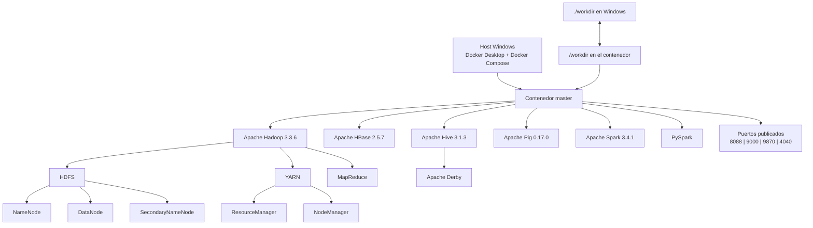

# Diagrama de arquitectura

```mermaid
flowchart TB
    HOST["Host Windows<br/>Docker Desktop + Docker Compose"]
    MASTER["Contenedor master"]

    HOST --> MASTER

    WORKDIR["./workdir en Windows"]
    CWORKDIR["/workdir en el contenedor"]

    WORKDIR <--> CWORKDIR
    CWORKDIR --> MASTER

    MASTER --> HADOOP["Apache Hadoop 3.3.6"]

    HADOOP --> HDFS["HDFS"]
    HADOOP --> YARN["YARN"]
    HADOOP --> MAPREDUCE["MapReduce"]

    HDFS --> NAMENODE["NameNode"]
    HDFS --> DATANODE["DataNode"]
    HDFS --> SECONDARY["SecondaryNameNode"]

    YARN --> RM["ResourceManager"]
    YARN --> NM["NodeManager"]

    MASTER --> HBASE["Apache HBase 2.5.7"]
    MASTER --> HIVE["Apache Hive 3.1.3"]
    HIVE --> DERBY["Apache Derby"]

    MASTER --> PIG["Apache Pig 0.17.0"]
    MASTER --> SPARK["Apache Spark 3.4.1"]
    MASTER --> PYSPARK["PySpark"]

    MASTER --> PORTS["Puertos publicados<br/>8088 | 9000 | 9870 | 4040"]
```